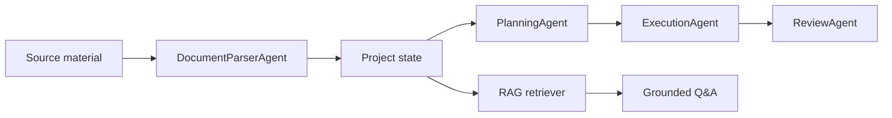

# AI Project Agent

AI Project Agent is a runnable prototype for an AI-driven personal knowledge management and project execution assistant. It helps users turn scattered documents, code notes, meeting records, and todos into a living project state.

The prototype demonstrates a four-agent workflow:

- **Document Parser Agent** extracts facts, goals, progress, risks, todos, and entities from uploaded material.
- **Planning Agent** converts facts into concrete next actions and prioritizes the project backlog.
- **Execution Agent** drafts project briefs, meeting notes, code-oriented suggestions, and action recommendations.
- **Review Agent** checks whether generated output is grounded in the original source snippets.

It also includes a lightweight retrieval layer for question answering. The current implementation is dependency-free and runs locally, so reviewers can try the full flow without requiring an API key. A future version can replace the heuristic agent functions with Xiaomi-compatible model calls through the provider boundary in `src/llm/`.

## Why This Project

Project context often lives across chat logs, markdown files, source code, issue trackers, meeting notes, and personal todos. Manual organization is repetitive and error-prone. This agent keeps project memory current by processing each new material, updating structured state, and answering questions with traceable source snippets.

## Architecture



## Project Structure

```text
src/
  agents/       Four agent implementations
  domain/       Project state and schema definitions
  llm/          Future model provider interface
  rag/          Retrieval and grounded Q&A
  storage/      Local state persistence
  workflows/    Multi-agent orchestration and brief generation
  utils/        Shared text helpers
```

## Features

- Upload or paste project materials from the browser.
- Automatically extract project goals, current progress, risks, todos, decisions, and key entities.
- Convert extracted todos into prioritized task items and risks into severity-scored mitigation items.
- Update a persistent project state after every new source.
- Ask RAG-style questions and get answers with supporting snippets.
- Retrieve evidence with source title, chunk heading, line range, score, and answer confidence.
- Say clearly when the current material does not contain enough evidence.
- Run a four-stage agent pipeline with parser, planner, executor, and reviewer outputs.
- Review generated recommendations with confidence scores, unsupported terms, and grounding checks.
- Export a generated project brief from the current knowledge base.
- Use a product-style workspace with dashboard, documents, tasks, risks, Q&A, briefs, and agent runs.

## Quick Start

```bash
npm start
```

Then open:

```text
http://localhost:3000
```

Run the command-line demo:

```bash
npm run demo
```

Run a smoke test:

```bash
npm test
```

## API

```http
GET /api/state
POST /api/ingest
POST /api/ask
GET /api/brief
POST /api/reset
```

## Model Integration Plan

Copy `.env.example` to `.env` after token access is approved:

```bash
XIAOMI_API_KEY=your_token
XIAOMI_BASE_URL=https://api.example.com
XIAOMI_MODEL=model_name
LLM_PROVIDER=xiaomi
```

The current code keeps this as a planned integration point, so the prototype remains runnable for review without credentials.

## Documentation

- [Architecture](docs/architecture.md)
- [Agent workflow](docs/agent-workflow.md)
- [Model integration](docs/model-integration.md)

Example ingest payload:

```json
{
  "title": "Sprint meeting notes",
  "content": "Goal: ship MVP. Risk: API quota is unknown. Todo: prepare GitHub demo."
}
```

Example ask payload:

```json
{
  "question": "What are the main risks?"
}
```

## Roadmap

- Add Xiaomi model integration for structured extraction and answer generation.
- Support PDFs, Word documents, GitHub repositories, and meeting transcript imports.
- Add embedding-based retrieval and reranking.
- Add a human approval queue for risky actions.
- Add multi-project workspaces and scheduled project health checks.

## License

MIT
