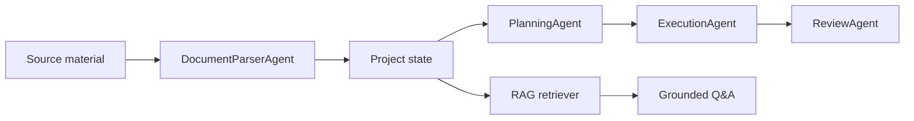

# AI Project Agent

AI Project Agent is a runnable prototype for an AI-driven personal knowledge management and project execution assistant. It turns scattered project documents, code notes, meeting records, risks, and todos into a structured project state with multi-agent reasoning and RAG citations.

The project is built for review without any model token, while keeping a Xiaomi-compatible model provider boundary for future token usage.

## Core Value

Project context often lives across chat logs, markdown files, source code, issue trackers, meeting notes, and personal todos. Manual organization is repetitive and error-prone. This agent keeps project memory current by processing each new material, updating structured state, and answering questions with traceable source snippets.

## Agent Workflow



- **Document Parser Agent** extracts facts, goals, progress, risks, todos, decisions, and entities.
- **Planning Agent** converts facts into prioritized task items and identifies blockers.
- **Execution Agent** drafts project briefs, action recommendations, and deliverables.
- **Review Agent** checks grounding, confidence, unsupported terms, and risk awareness.

## Features

- Chinese product workspace with dashboard, documents, tasks, risks, Q&A, briefs, and agent runs.
- Local-first multi-agent workflow that runs without credentials.
- Structured project memory: facts, tasks, risks, decisions, briefs, and run history.
- RAG question answering with source title, chunk heading, line range, score, and confidence.
- Clear insufficient-evidence behavior when uploaded material cannot answer a question.
- Xiaomi-compatible provider layer with model fallback metadata.
- Focused smoke tests using Node.js built-in assertions.

## Quick Start

```bash
npm start
```

Open:

```text
http://localhost:3000
```

Run the demo:

```bash
npm run demo
```

Run tests:

```bash
npm test
```

## API

```http
GET /api/state
POST /api/ingest
POST /api/ask
GET /api/brief
POST /api/reset
```

Example ingest payload:

```json
{
  "title": "Sprint meeting notes",
  "content": "Goal: ship MVP. Risk: API quota is unknown. Todo: prepare GitHub demo."
}
```

Example ask payload:

```json
{
  "question": "What are the main risks?"
}
```

## Model Integration

The app defaults to local deterministic behavior. After token access is approved, copy `.env.example` to `.env` and configure:

```bash
XIAOMI_API_KEY=your_token
XIAOMI_BASE_URL=https://api.example.com/v1
XIAOMI_MODEL=model_name
LLM_PROVIDER=xiaomi
LLM_ENABLED=true
```

When `LLM_ENABLED=true`, the execution agent attempts a structured model call. If the provider is unavailable, misconfigured, or returns non-JSON content, the workflow records the fallback reason and continues with local rules.

## Project Structure

```text
src/
  agents/       Four agent implementations
  domain/       Project state and schema definitions
  llm/          Mock and Xiaomi-compatible model providers
  rag/          Chunking, retrieval, intent detection, and grounded Q&A
  storage/      Local state persistence
  tests/        Focused smoke tests
  workflows/    Multi-agent orchestration and brief generation
  utils/        Shared text helpers
```

## Documentation

- [Architecture](docs/architecture.md)
- [Agent workflow](docs/agent-workflow.md)
- [RAG design](docs/rag.md)
- [Frontend workspace](docs/frontend.md)
- [Model integration](docs/model-integration.md)
- [Testing](docs/testing.md)
- [Roadmap](docs/roadmap.md)
- [Application note](docs/application-note.md)

## Token Usage Plan

Free Xiaomi model quota will be used for:

- Higher quality document parsing and structured fact extraction.
- Multi-step planning with clearer priorities, dependencies, and blockers.
- Execution drafts such as project briefs, meeting minutes, and action plans.
- Review Agent checks for grounding, unsupported claims, and hallucination risk.

## License

MIT
