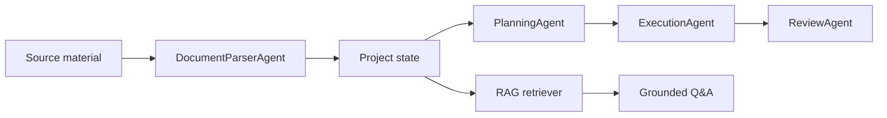

# Architecture

AI Project Agent is organized around a local-first multi-agent workflow. The current code runs without a model token, while keeping a clear integration point for model providers.

## Runtime Modules

- `server.js` exposes the HTTP API and static web app.
- `src/agents/` contains individual agent implementations.
- `src/workflows/` orchestrates agent execution and brief generation.
- `src/rag/` handles document chunking, retrieval, intent detection, and grounded question answering.
- `src/storage/` persists project state.
- `src/domain/` defines state creation and schema documentation.
- `src/llm/` reserves a provider interface for future model calls.

## Current Prototype Boundary

The first version uses deterministic local heuristics. This makes the project easy to review and run without credentials. After token access is approved, the agent internals can call `LLMClient` while keeping the same API surface.
